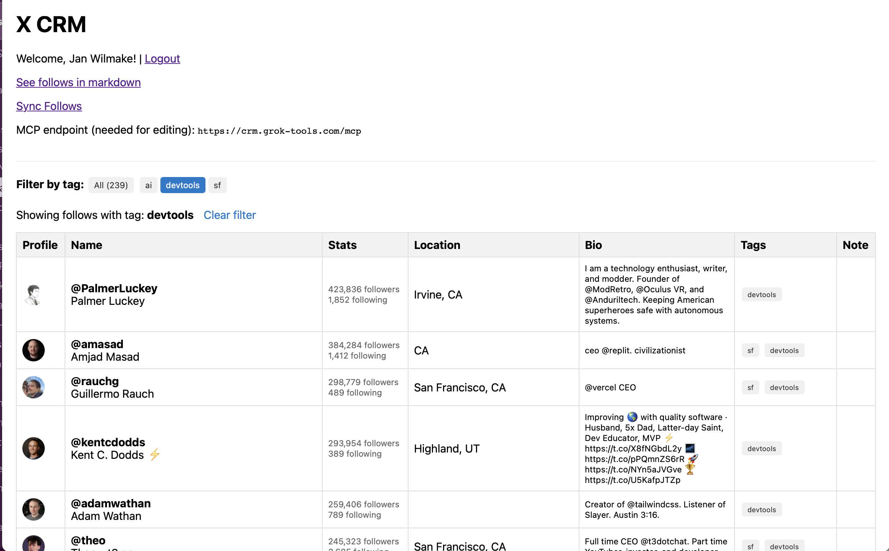

# X CRM MCP

- login with X with follows scope
- sync into a list of follows with
  - user details
  - note
- make that accessible over MCP as one large context with 2 tools
  - getFollows()
  - setNote(username,note)

Target Flow enabled by this:

1. get all follows and their public details and some info
2. use with deep research to find more info on them online, such as personal blog, GitHub, insta, etc
3. use LLM to find specific people in my network that want a very specific thing that I can help them with
4. use ai to read and write notes on my network

Context:

- simplerauth using x oauth provider (login.wilmake.com) https://uithub.com/janwilmake/universal-mcp-oauth/tree/main/simplerauth-client/README.md
- twitter api https://uithub.com/janwilmake/twitterapi-openapi/blob/main/openapi.json
- flaredream https://flaredream.com/system-ts.md
- with-mcp: https://uithub.com/janwilmake/with-mcp

Implementation:

- After X login of a user, fetches all follows using twitterapi, stores it in users own durable object.
- Exposes endpoints `GET /follows` and `POST /note/{username}?note={note}` and expose those through tools using an openapi and `withMcp`
- NB: withSimplerAuth is wrapped within the withMcp handler
- add column `tags` into the table
- allow getFollows(tag?:string) to filter on a tag
- allow setNote to also update tags (must be comma separated) (call it `updateContact`)
- in the markdown, put unique tags at the top
- add a html version (renders at index) that renders all follows in a table, with ability to click a tag to navigate to ?tag={tag} to filter on this.
